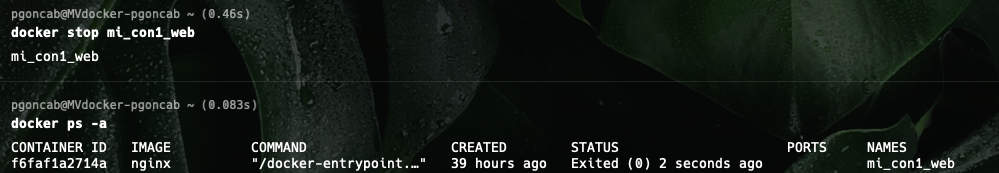
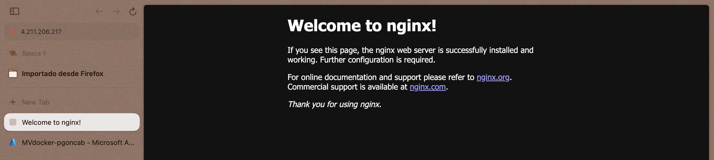

# Práctica 1:

# Práctica 2:

## Tarea 2.1:

\<docker images\>

## Tarea 2.2:

\<docker pull ubuntu\>

## Tarea 2.3:

\<docker pull ubuntu:focal\>

## Tarea 2.4:

\<docker pull nginx\>

## Tarea 2.5:

\<docker rmi hello-world -f\>

# Práctica 3:

## Tarea 3.1:

\<docker ps -a\>

## Tarea 3.2:

\<docker inspect suspicious_wozniak\>

## Tarea 3.3:

\<docker inspect --format '{{ .State }}' suspicious_wozniak\>

## Tarea 3.4:

\<docker inspect --format '{{ .Config.Entrypoint }}' ubuntu:focal\>

\<docker inspect --format '{{ .Config.Cmd }}' ubuntu:focal\>

## Tarea 3.5:

\<docker run -d --name mi_con1 --entrypoint /bin/hostname ubuntu:focal\>

## Tarea 3.6:

\<docker run -d --name mi_con2 --entrypoint /bin/hostname ubuntu:focal josegqui.mucnap.cc.upv.es\>

## Tarea 3.7:

\<docker run -d --name mi_cont3 ubuntu:focal /bin/hostname\>

## Tarea 3.8:

\<docker run -d --name mi_con1_web nginx\>

## Tarea 3.9:

\<docker start mi_con1\>

\<docker start -a mi_con1\>

## Tarea 3.10:

\<docker start mi_con1_web\>

\<docker ps\>

## Tarea 3.11:

## Tarea 3.12:

\<docker stop mi_con1_web\>

## Tarea 3.13:

\<docker create --name mi_con3 ubuntu:focal /bin/hostname\>

\<docker start 4ae0f4f9f46ffbdd00cb70d719b142ae769e89f2d1e1050e4bae400b313a0095\>

## Tarea 3.14:

\<docker run --name mi_con3_run ubuntu:focal /bin/hostname\>

## Tarea 3.15:

\<docker run -d --name mi_con3_run2 ubuntu:focal /bin/hostname\>

## Tarea 3.16 (no hay estado porque se ha borrado y ya no aparece):

\<docker stop mi_con1_web\>

\<docker rm mi_con1_web\>

# Práctica 4:

## Tarea 4.1:

\<docker create --name mi_con2_web -p 8080:80 nginx\>

\<docker ps -a\>

## Tarea 4.2:

\<docker start e2d63d6572f6\>

\<docker ps\>

## Tarea 4.3:

Solo si se añade la configuración necesaria como "inbound rule" para puerto 8080 en la MV de Azure.

## Tarea 4.4:

No se puede porque ese nombre ya pertenece a un contenedor.

## Tareas 4.5 y 4.6:

Falla porque ya se ha usado ese puerto:  
\<docker stop 762745bfdc01\>

\<docker create --name mi_con3_web -p 8080:80 -p 8043:433 nginx\>

\<docker start mi_con3_web\>

\<docker ps -a\>

## Tarea 4.7:

\<docker create --name mi_con4_web --expose 80 --expose 433 -P nginx\>

\<docker start be82d35de64862e290dffc1e18c02739ebcca62e7e8df9f808a0a9a7756d88c7\>

\<docker ps -a\>

## Tarea 4.8:

Al no haber expuesto los puertos, no salen con estos comandos, por eso he puesto en la captura el otro contenedor.  
Tampoco pasa nada porque no afecta al funcionamiento del contenedor y el "export" solo es para metadata del propio contenedor.
\<docker inspect --format {{.NetworkSettings.Ports}} mi_con4_web\>

\<docker port mi_con4_web\>

# Práctica PA1:

\<docker pull docker.io/gnuoctave/octave:9.2.0\>

\<docker run --name solver_octave_basico gnuoctave/octave:9.2.0 octave --eval "disp(sqrt(25) + sin(pi/2));"\>

# Práctica PA2:

\<docker pull tomcat:9.0\>

\<docker run -d --name servidor_web_tomcat -p 8000:8080 tomcat:9.0\>

# Práctica P5:

## Tarea 5.1:

\<docker create --name mi_con1_int -it ubuntu:focal "/bin/hostname"\>

\<docker start -a mi_con1_int\>

## Tarea 5.2:

\<docker create --name mi_con2_int -t ubuntu:focal /bin/bash\>

\<docker start -a mi_con2_int\>

## Tarea 5.3:

\<docker create --name mi_con3_int -it ubuntu:focal /bin/bash\>

\<docker start -a mi_con3_int\>

## Tarea 5.4:

\<docker create --name mi_con4_int -it ubuntu:focal /bin/bash\>

\<docker start mi_con4_int\>

\<docker attach ac5df23c753b39289fb19c4c7b86887499d461c09e934102bceada6a1f5d2d6f\>

## Tarea 5.5:

\<docker create --name mi_con5_int ubuntu:focal /bin/bash\>

\<docker start mi_con5_int\>

\<docker exec mi_con5_int /bin/ls\>

## Tarea 5.6:

\<docker create --name mi_con6_int -i ubuntu:focal /bin/bash\>

\<docker start mi_con6_int\>

\<docker exec mi_con6_int /bin/ls\>

\<docker exec mi_con6_int /bin/ps\>

\<docker exec mi_con6_int /bin/pwd\>

## Tarea 5.7:

\<docker create --name mi_con7_int -i ubuntu:focal /bin/bash\>

\<docker start mi_con7_int\>

\<docker exec -it mi_con7_int /bin/bash\>

# Práctica P6:

## Tarea 6.1:

\<docker run -d --name mi_con1_vol -i ubuntu:focal /bin/bash\>

\<docker exec mi_con1_vol /bin/touch /tmp/mifichero.txt\>

\<docker exec mi_con1_vol /bin/ls /tmp\>

\<docker restart mi_con1_vol\>

\<docker exec mi_con1_vol /bin/ls /tmp\>

## Tarea 6.2:

\<docker rm -f mi_con1_vol\>

\<docker run -d --name mi_con1_vol -i ubuntu:focal /bin/bash\>

\<docker exec mi_con1_vol /bin/ls /tmp\>

## Tarea 6.3:

\<docker volume create mi_vol_persistente\>

\<docker volume ls\>

## Tarea 6.4 (no hay foto de los primeros comandos porque me salen muchos logs sin sentido debido a un fallo en la MV):

\<docker run -d --name mi_con2_vol -i -v mi_vol_persistente:/persiste ubuntu:focal /bin/bash\>

\<docker exec mi_con2_vol /bin/touch /persiste/mifichero.txt\>

\<docker exec mi_con2_vol /bin/ls /tmp\>

\<docker stop mi_con2_vol\>

\<docker rm -f mi_con2_vol\>

\<docker run -d --name mi_con2_vol -i -v mi_vol_persistente:/persiste ubuntu:focal /bin/bash\>

\<docker exec mi_con2_vol /bin/ls /persiste\>

## Tarea 6.5:

\<docker run -d --name mi_con3_vol -v $HOME:/mnt -it ubuntu:focal /bin/bash\>

\<docker exec mi_con3_vol cat /mnt/mi_nombre.txt\>

## Tarea 6.6:

\<echo "Pablo" > $HOME/mi_nombre.txt\>

\<docker exec mi_con3_vol cat /mnt/mi_nombre.txt\>

## Tarea 6.7:

\<docker attach mi_con3_vol\>

\<echo -e "Pablo\nPablo" > /mnt/mi_nombre.txt\>

\<docker exec mi_con3_vol cat /mnt/mi_nombre.txt\>

## Tarea 6.8:

\<docker run -d --name mi_con4_vol -it -v /persiste ubuntu:focal /bin/bash\>

\<docker exec mi_con4_vol touch /persiste/fichero.txt\>

\<docker exec mi_con4_vol /bin/ls /persiste\>

\<docker volume ls\>

## Tarea 6.9:

\<echo "Este es el contenido de mi_fichero1.txt" > $HOME/mi_fichero1.txt\>

\<docker start mi_con3_vol\>

\<docker cp $HOME/mi_fichero1.txt mi_con3_vol:/tmp/\>

\<docker exec mi_con3_vol cat /tmp/mi_fichero1.txt\>

## Tarea 6.10:

\<docker exec mi_con3_vol touch /tmp/mi_fichero3.txt\>

\<docker cp mi_con3_vol:/tmp/mi_fichero3.txt $HOME/\>

\<ls $HOME/mi_fichero3.txt\>

# Práctica P7:

## Tarea 7.1 (hay mucho log y por eso la captura es sin lanzar "apt-get ..."):

\<docker start mi_con3_int\>

\<docker attach mi_con3_int\>

\<apt-get update && apt-get install python\>

\<docker commit mi_con3_int ubuntu:python\>

\<docker images\>

# Práctica PA3:

Aunque el comando Docker build también se usó para generar la imagen final, este paso no es estrictamente necesario.

Con Docker commit, todo el estado del contenedor (incluyendo dependencias y archivos) ya está guardado, por lo que la imagen resultante está lista para ser reutilizada directamente. Sin embargo, el comando de build se ha incluido como una forma más automatizada y reproducible de generar la imagen, de acuerdo con las mejores prácticas de Docker.

Entiendo que realizar una compilación Docker posterior con el mismo nombre y etiqueta no elimina la imagen creada previamente con Docker commit, sino que genera una nueva imagen con un identificador diferente y reasigna la etiqueta para que apunte a ella. Como resultado, la imagen original permanece sin etiquetar (dangling) y puede eliminarse posteriormente mediante una limpieza manual o automática.

\<docker run -d --name solver_suma_vec -it ubuntu:focal\>

\<docker attach solver_suma_vec\>

\<apt-get update && apt-get install python && apt-get install python-numpy\>

\<vim suma_vectores.py\> (se ha añadido una línea al principio para que detecte la tilde)

\<cat suma_vectores.py\>

\<docker cp $HOME/suma_vectores.py solver_suma_vec:/home\>

\<vim Dockerfile\>

\<cat Dockerfile\>

\<docker commit solver_suma_vec mi_img_suma_vectores:latest\>

\<docker build -t mi_img_suma_vectores:latest .\>

\<docker run -d --name solver_suma_vec2 -it mi_img_suma_vectores:latest\>

\<docker exec solver_suma_vec2 python suma_vectores.py "1,2,3" "4,5,6"\>

# Práctica PA4:

Aunque el comando Docker build también se usó para generar la imagen final, este paso no es estrictamente necesario.

Con Docker commit, todo el estado del contenedor (incluyendo dependencias y archivos) ya está guardado, por lo que la imagen resultante está lista para ser reutilizada directamente. Sin embargo, el comando de build se ha incluido como una forma más automatizada y reproducible de generar la imagen, de acuerdo con las mejores prácticas de Docker.

Entiendo que realizar una compilación Docker posterior con el mismo nombre y etiqueta no elimina la imagen creada previamente con Docker commit, sino que genera una nueva imagen con un identificador diferente y reasigna la etiqueta para que apunte a ella. Como resultado, la imagen original permanece sin etiquetar (dangling) y puede eliminarse posteriormente mediante una limpieza manual o automática.

\<vim procesa.m\>

\<cat procesa.m\>

\<vim A\>

\<cat A\>

\<vim B\>

\<cat B\>

\<docker run -d -it --name contenedor_octave ubuntu:focal\>

\<docker attach contenedor_octave\>

\<apt-get update && apt-get install -y octave\>

\<mkdir octave\> (no aparece en la captura pero es necesario)

\<docker cp $HOME/procesa.m contenedor_octave:/octave/procesa.m\>

\<docker cp $HOME/A contenedor_octave:/octave/A\>

\<docker cp $HOME/B contenedor_octave:/octave/B\>

\<vim Dockerfile\>

\<cat Dockerfile\>

\<docker commit contenedor_octave mi_img_octave:latest\>

\<docker build -t mi_img_octave:latest .\>

\<docker run -d --name contenedor_octave2 -it mi_img_octave:latest\>

\<docker exec contenedor_octave2 octave /octave/procesa.m\>

# Práctica P8:

## Tarea 8.1:
