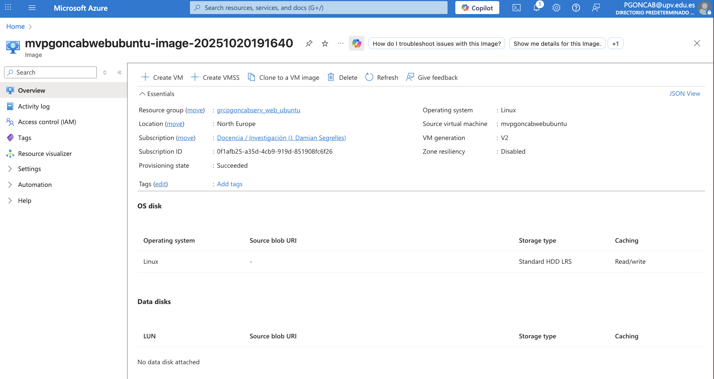

# Práctica 1:

# Práctica 2:

## Acceso con Usuario y contraseña:

## Config del DNS:

## Acceso con SSH Key:

## Evidencias de las claves (pública y privada):

## Evidencia de la configuración DNS de la máquina:

# Práctica 3:

# Práctica 4:

# Práctica 6:

