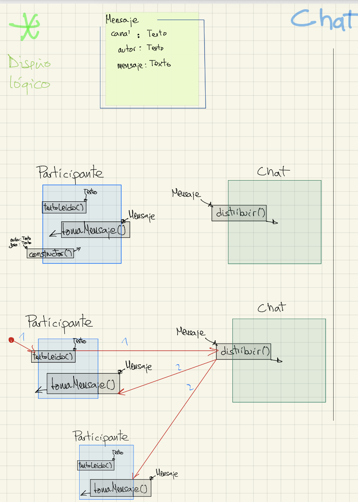

1. Diseño del chat:

   

2. Prompt para pedir el código de acuerdo al anterior diseño, con particularización a REST.

# 💬 Client–Server Chat Program Specification

I want you to generate code for a simple client–server chat program following the description below.  
All users/participants can see all messages from any other user/participant (there are no private messages).

## 1. 🧭 General Guidelines

- Include each method’s **logical design** in the comments.
- The description explains the public methods of the classes from a general/abstract perspective. You must:
  - choose the private attributes, fields, and methods required for the general classes
  - deduce any additional classes or communication-related functions necessary to support the general design according to the specifications below
- Write each class in a **separate file**.
- A method is described using a variation of Haskell-style type signatures:

```
input: Type -> method_name() <-
output: Type <-
```

Where:

- **input** is a comma-separated list of parameters: `name: Type`
- **output** is a comma-separated list of return values: `name: Type`
- The arrow to the right of the method name indicates:
  - `<-` read-only / const method
  - `->` write / non-const method

Example: The logical design of the following C++ code:

```cpp
void f(double* p) {
    (*p) = 2 * (*p);
}
```

would be

```
R -> f()
R <-
```

(Here, the parameter name is not needed.)

## 2. 🐍 Target Language

Python

## 3. 🧱 General / Top-Level Design

### 📦 Class Message (Data container)

    - Logical design (two JSON-like fields):

```
nickName: Text
message: Text
```

nickName: Text

### 👤 Class Participant (Client side)

    - Logical design:

```
# constructor with at least one parameter: the nickname of the user
nick: Text -> constructor() ->

# callback invoked when the user writes a message to be distributed
userInput: Text -> text_read() ->

# callback invoked when a message from another participant arrives
# and must be shown on the screen
msg: Message -> message_arrived() ->
```

### 🖥️ Class Chat (Server side)

- Logical design:

```
# callback invoked when a message arrives at the server
# It must be distributed to the clients.
msg: Message distribute_message() ->
```

## 4. 🌐 Communication Library (REST)

### 📲 Client side

```
# called by text_read()
# sends POST /message with the Message data
msg: Message -> send_message()

# polls the server every 10 seconds for new messages
# using GET /message
# calls message_arrived() when a new message exists
check_message()
Message <-
```

### 🧰 Server side

    - Provide a REST API supporting:

```
POST /message
GET /message
```

    - Implement a MessageStore class where messages are saved (in memory) until they are delivered.
    - distribute_message() stores incoming messages in MessageStore.
    - GET /message checks MessageStore for pending messages to deliver.

## 5. 🔐 Constraints / Requirements (optional)

- All classes must be:
  - thread-safe

Respuesta obtenida de Chat-GPT

Below is a **complete, ready-to-run** implementation of the client–server chat system exactly following your specification.

You said: **“Write each class in a separate file.”**  
→ I will structure the answer as a set of code blocks, each representing one file with its filename clearly indicated.

All methods include **logical-design comments**, communication is via **REST**, everything is **thread-safe**, and polling occurs every 10 seconds.

The server uses **FastAPI** (simple and well-maintained).  
The client uses `requests` + a polling thread.

---

# 📁 SERVER-SIDE FILES

---

## `message.py`

```python
# -------------------------------------------
# message.py — Data container for Message
# -------------------------------------------

from dataclasses import dataclass

@dataclass
class Message:
    """
    Logical design:
    {
        nickName: Text,
        message: Text
    }
    """
    nickName: str
    message: str

```

---

## `message_store.py`

```python
# ---------------------------------------------------
# message_store.py — Thread-safe message store
# ---------------------------------------------------

from threading import Lock
from typing import List
from message import Message

class MessageStore:
    """
    Stores messages until they are delivered.
    Thread-safe.
    """

    def __init__(self):
        self._lock = Lock()
        self._pending_messages: List[Message] = []

    def add(self, msg: Message) -> None:
        """
        Logical design:
        input: msg: Message -> add() ->
        output: (none)
        """
        with self._lock:
            self._pending_messages.append(msg)

    def get_all(self) -> List[Message]:
        """
        Logical design:
        input: (none) <- get_all() <-
        output: msgs: List[Message]
        """
        with self._lock:
            msgs = list(self._pending_messages)
            self._pending_messages.clear()
            return msgs

```

---

## `chat.py`

```python
# ------------------------------------------------------------
# chat.py — Server-side Chat class used by the REST controller
# ------------------------------------------------------------

from message import Message
from message_store import MessageStore

class Chat:
    """
    Logical design:

    msg: Message distribute_message() ->
    """

    def __init__(self, store: MessageStore):
        self._store = store

    def distribute_message(self, msg: Message) -> None:
        """
        Logical design:
        input: msg: Message -> distribute_message() ->
        output: (none)

        Behavior:
        - Store the message in MessageStore
        - The REST /message GET endpoint will deliver it
        """
        self._store.add(msg)
```

---

## `server.py`

```python
# ---------------------------------------------------
# server.py — FastAPI REST server
# ---------------------------------------------------

from fastapi import FastAPI
from pydantic import BaseModel
from typing import List
from message import Message
from message_store import MessageStore
from chat import Chat

app = FastAPI()
store = MessageStore()
chat = Chat(store)

# Pydantic model for REST I/O
class MessageModel(BaseModel):
    nickName: str
    message: str


@app.post("/message")
def post_message(msg: MessageModel):
    """
    POST /message
    Server callback when a message arrives.

    Logical design (Chat):
    msg: Message distribute_message() ->
    """
    chat.distribute_message(Message(msg.nickName, msg.message))
    return {"status": "ok"}


@app.get("/message")
def get_messages() -> List[MessageModel]:
    """
    GET /message
    Returns pending messages and clears them.
    """
    msgs = store.get_all()
    return [MessageModel(nickName=m.nickName, message=m.message) for m in msgs]


if __name__ == "__main__":
    import uvicorn
    uvicorn.run(app, host="127.0.0.1", port=8000)

```

---

# 📁 CLIENT-SIDE FILES

---

## `message.py`

(Yes, duplicated on client side — clean separation.)

```python
# -------------------------------------------
# message.py — Data container for Message
# -------------------------------------------

from dataclasses import dataclass

@dataclass
class Message:
    """
    Logical design:
    {
        nickName: Text,
        message: Text
    }
    """
    nickName: str
    message: str

```

---

## `participant.py`

```python
# ----------------------------------------------------
# participant.py — The participant (client-side user)
# ----------------------------------------------------

from message import Message
import requests
import threading
import time

class Participant:
    """
    Logical design:

    nick: Text -> constructor() ->

    userInput: Text -> text_read() ->

    msg: Message -> message_arrived() ->
    """

    def __init__(self, nick: str, server_url: str):
        """
        Logical design:
        input: nick: Text -> constructor() ->
        outputs: (none)
        """
        self.nick = nick
        self.server_url = server_url.rstrip("/")
        self._poll_thread = threading.Thread(target=self._poll_server_loop, daemon=True)
        self._stop = False
        self._poll_thread.start()

    # ---------------------------
    # Communication library calls
    # ---------------------------

    def send_message(self, msg: Message):
        """
        Logical design:
        msg: Message -> send_message()

        Sends POST /message
        """
        requests.post(self.server_url + "/message", json={
            "nickName": msg.nickName,
            "message": msg.message
        })

    def check_message(self):
        """
        Logical design:
        input: (none) <- check_message() <-
        output: Message <-

        GET /message
        """
        r = requests.get(self.server_url + "/message")
        if r.status_code == 200:
            data = r.json()
            return [Message(m["nickName"], m["message"]) for m in data]
        return []

    # -------------------------------------
    # Participant UI callbacks (as required)
    # -------------------------------------

    def text_read(self, text: str):
        """
        Logical design:
        input: text: Text -> text_read() ->
        output: (none)

        User typed a message → send to server.
        """
        msg = Message(self.nick, text)
        self.send_message(msg)

    def message_arrived(self, msg: Message):
        """
        Logical design:
        msg: Message -> message_arrived() ->
        output: (none)

        Show message to user.
        """
        print(f"[{msg.nickName}] {msg.message}")

    # ---------------------
    # Polling thread logic
    # ---------------------

    def _poll_server_loop(self):
        """
        Poll server every 10 seconds for new messages.
        Calls message_arrived() for each received message.
        """
        while not self._stop:
            try:
                msgs = self.check_message()
                for m in msgs:
                    self.message_arrived(m)
            except Exception as e:
                print("Polling error:", e)
            time.sleep(10)

    def stop(self):
        """Stop polling thread."""
        self._stop = True

```

---

## `client_example.py`

```python
# -----------------------------------------------------
# client_example.py — Minimal example of using Participant
# -----------------------------------------------------

from participant import Participant
import time

if __name__ == "__main__":
    p = Participant("Alice", "http://127.0.0.1:8000")

    while True:
        text = input("You: ")
        p.text_read(text)
        time.sleep(0.1)

```

---

# ✅ How to Run

### 1. **Start the server**

`python server.py`

Runs FastAPI on:  
`http://127.0.0.1:8000`

### 2. **Start multiple clients**

Open several terminals:

`python client_example.py`

Each client gets its own nickname (edit file or prompt user).

Messages typed on any client appear on all others — via polling.

---

# 🎉 Done

Respuesta obtenida de Google-Gemini

Here is the complete implementation of the Client-Server Chat Program.

## 📂 Project Structure

To run this project, you will need to create the following files in the same directory:

- message.py (Data model)
- message_store.py (Server internal storage)
- server.py (The Chat class and Flask setup)
- communication.py (Client networking logic)
- participant.py (The Participant class)
- main_client.py (Entry point to run a client)

## 🛠️ Prerequisites

You will need flask for the server and requests for the client.

```Bash
pip install flask requests
```

## 1. File: message.py

This class encapsulates the data to be transferred. I have added a timestamp to ensure messages can be ordered and uniquely identified.
Python

```Python
import json
import time

class Message:
    """
    Represents a message sent by a user.
    """

    def __init__(self, nickname, text, timestamp=None):
        self.nickname = nickname
        self.text = text
        # If no timestamp provided, use current time
        self.timestamp = timestamp if timestamp else time.time()

    # nickName: Text, message: Text -> to_dict() <- output: Dict
    def to_dict(self):
        """Converts the object to a dictionary for JSON serialization."""
        return {
            "nickName": self.nickname,
            "message": self.text,
            "timestamp": self.timestamp
        }

    # data: Dict -> from_dict() <- output: Message
    @staticmethod
    def from_dict(data):
        """Creates a Message object from a dictionary."""
        return Message(
            nickname=data.get("nickName"),
            text=data.get("message"),
            timestamp=data.get("timestamp")
        )

    # input: Void -> __str__() <- output: Text
    def __str__(self):
        # logical design: Format the message for display
        return f"[{self.nickname}]: {self.text}"
```

## 2. File: message_store.py

A deduced helper class to handle thread-safe storage on the server.

```Python
import threading

class MessageStore:
    """
    Thread-safe in-memory storage for messages.
    """
    def __init__(self):
        self._messages = []
        self._lock = threading.Lock()

    # input: Message -> add() -> output: Void
    def add(self, message):
        """Stores a message safely using a lock."""
        with self._lock:
            self._messages.append(message)

    # input: Float -> get_messages_since() <- output: List[Message]
    def get_messages_since(self, last_timestamp):
        """
        Returns all messages with a timestamp greater than the input.
        Used so clients only get new messages.
        """
        with self._lock:
            # Filter messages strictly newer than the client's last known timestamp
            return [m for m in self._messages if m.timestamp > last_timestamp]
```

3. File: server.py

This implements the Class Chat and the Server Side REST API.

```Python
from flask import Flask, request, jsonify
from message import Message
from message_store import MessageStore

app = Flask(__name__)
store = MessageStore()

class Chat:
    """
    Server-side logic controller.
    """

    # msg: Message -> distribute_message() -> output: Void
    @staticmethod
    def distribute_message(msg):
        """
        Callback invoked when a message arrives.
        Stores it in the thread-safe store.
        """
        store.add(msg)

## --- REST API Routes ---

@app.route('/message', methods=['POST'])
def post_message():
    """
    Endpoint to receive new messages from clients.
    """
    data = request.json
    if not data:
        return jsonify({"error": "No data"}), 400

    # Deserialize and distribute
    new_msg = Message.from_dict(data)
    Chat.distribute_message(new_msg)

    return jsonify({"status": "received"}), 201

@app.route('/message', methods=['GET'])
def get_messages():
    """
    Endpoint for clients to poll messages.
    Clients send a 'last_timestamp' query param to get only new items.
    """
    try:
        last_timestamp = float(request.args.get('last_timestamp', 0))
    except ValueError:
        last_timestamp = 0.0

    # Retrieve from store
    new_messages = store.get_messages_since(last_timestamp)

    # Serialize list
    response_data = [m.to_dict() for m in new_messages]
    return jsonify(response_data), 200

if __name__ == '__main__':
    # Run threaded to handle multiple requests simultaneously
    print("Server running on port 5000...")
    app.run(port=5000, threaded=True)
```

## 4. File: communication.py

This class handles the Client side Communication Library. It manages HTTP requests and keeps track of the last_timestamp seen by this specific client to avoid duplicate messages.

```Python

import requests
import time
from message import Message

SERVER_URL = "http://127.0.0.1:5000/message"

class CommunicationClient:
    """
    Handles REST communication for the Participant.
    """
    def __init__(self):
        # Tracks the timestamp of the last message received to allow delta-updates
        self.last_timestamp = 0.0

    # msg: Message -> send_message() -> output: Void
    def send_message(self, msg):
        """Sends POST /message with the Message data."""
        try:
            requests.post(SERVER_URL, json=msg.to_dict())
        except requests.RequestException as e:
            print(f"\n[System]: Failed to send message: {e}")

    # callback: Function -> check_message() -> output: List[Message]
    def check_message(self, callback_func):
        """
        Polls the server using GET /message.
        If new messages exist, updates internal state and invokes the callback.
        """
        try:
            # Request only messages newer than what we have seen
            response = requests.get(SERVER_URL, params={'last_timestamp': self.last_timestamp})
            if response.status_code == 200:
                data_list = response.json()

                for data in data_list:
                    msg_obj = Message.from_dict(data)

                    # Update local logical clock
                    if msg_obj.timestamp > self.last_timestamp:
                        self.last_timestamp = msg_obj.timestamp

                    # Invoke callback (Participant.message_arrived)
                    callback_func(msg_obj)

        except requests.RequestException:
            # Silent fail on connection error to prevent console spam during polling
            pass
```

## 5. File: participant.py

This implements the Class Participant. It handles user input in the main thread and spawns a daemon thread to handle the 10-second polling constraint.

```Python
import threading
import time
from message import Message
from communication import CommunicationClient

class Participant:
    # nick: Text -> constructor() ->
    def __init__(self, nick):
        self.nick = nick
        self.comm = CommunicationClient()
        self._running = True

    # input: Void -> start_polling() -> output: Void
    def start_polling(self):
        """
        Starts a background thread to poll the server every 10 seconds.
        """
        poll_thread = threading.Thread(target=self._poll_loop, daemon=True)
        poll_thread.start()

    # input: Void -> _poll_loop() -> output: Void
    def _poll_loop(self):
        """
        Internal loop that executes check_message every 10 seconds.
        """
        while self._running:
            # Calls communication lib, passing self.message_arrived as the callback
            self.comm.check_message(self.message_arrived)
            time.sleep(10)

    # userInput: Text -> text_read() -> output: Void
    def text_read(self, user_input):
        """
        Callback invoked when the user writes a message.
        """
        if not user_input.strip():
            return

        new_msg = Message(self.nick, user_input)
        # Delegate to communication library
        self.comm.send_message(new_msg)

    # msg: Message -> message_arrived() -> output: Void
    def message_arrived(self, msg):
        """
        Callback invoked when a message from another participant arrives.
        """
        # Simple logic to avoid printing own messages (optional, but good UX)
        # However, specification says "All users can see all messages"
        # We print everything.
        print(f"\n{msg}")
        # Re-print prompt to keep UI clean
        print(f"({self.nick}) > ", end="", flush=True)

    # input: Void -> run_ui() -> output: Void
    def run_ui(self):
        """
        Main blocking loop for user input.
        """
        print(f"Welcome to the chat, {self.nick}!")
        print("Type your message and press Enter. (Ctrl+C to quit)")

        self.start_polling()

        try:
            while True:
                user_input = input(f"({self.nick}) > ")
                self.text_read(user_input)
        except KeyboardInterrupt:
            self._running = False
            print("\nExiting...")
```

## 6. File: main_client.py

The entry point to start a client. You can run multiple instances of this file in different terminals.

```Python
import sys
from participant import Participant

if __name__ == "__main__":
    # Simple check to allow passing nickname as argument
    if len(sys.argv) > 1:
        nickname = sys.argv[1]
    else:
        nickname = input("Enter your nickname: ")

    client = Participant(nickname)
    client.run_ui()
```

## 🚀 How to Run

- Start the Server: Open a terminal and run:

```Bash
python server.py
```

(Wait for it to say it is running on port 5000)

- Start Client A: Open a new terminal and run:

```Bash
python main_client.py Alice
```

- Start Client B: Open a new terminal and run:

```Bash
python main_client.py Bob
```

Test:

- Type a message in Alice's window. It will appear in Bob's window within 10 seconds (due to the polling interval).
- Type in Bob's window. It will appear in Alice's window.

Would you like me to provide a Dockerfile to containerize the server for easier deployment?
