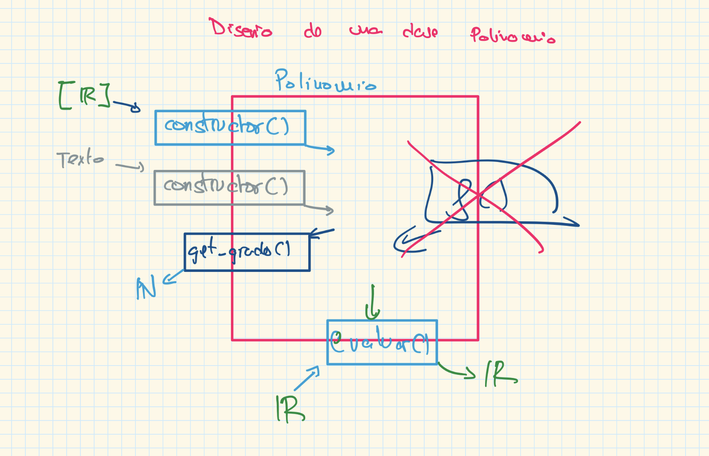

1. Diseño de la clase polinomio:



2. Promp para que una IA genere el código

# 📘 Class Design Specification

I want you to generate code for a class based on the following design.

---

## 1. 🧭 General Guidelines

- Include each method's **logical design** in the comments.
- Provide **simple example calls** to the class methods to show how the class is used.

---

## 2. 🐍 Target Language

**Python**

---

## 3. 🏷️ Class Name

**Polynomial**

---

## 4. 🎯 Purpose / Responsibility

This class represents a **polynomial** in a mathematical context.

---

## 5. 🔒 Private Attributes, Fields, and Methods

You will choose the attributes, fields, and methods required according to the design of the public methods.  
All of them must be **private**.

---

## 6. Public Methods

### ➕ constructor()

- **Logical design:**

```
coefficients: [R] -> constructor() ->
- `coefficients` is a list or array where `coefficients[i]` is the coefficient of **xⁱ**.
```

---

### 🎯 get_coef()

- **Logical design:**

```
i: N -> get_coef() <-
R <-
```

- Returns the coefficient of **xⁱ**.

---

### 📏 get_degree()

- **Logical design:**

```
get_degree() <-
N <-
```

- Returns the **degree** of the polynomial.

---

### 🧮 evaluate()

- **Logical design:**

```
x: R -> evaluate() <-
R <-
```

- Returns the value of the polynomial for a given **x**.

---

## 7. 🔗 Relationships (optional)

No relationships (inheritance, etc.) are required.

---

## 8. 🔐 Constraints / Requirements (optional)

The class must be:

- **immutable**
- **thread-safe**

3. Código generado por el anterior prompt:

from typing import Iterable, Tuple

class Polynomial:
"""
Represents a mathematical polynomial.
This class is immutable and thread-safe.
"""

    # ---------------------------------------------------------
    # ➕ constructor()
    # Logical design:
    #
    #   coefficients: [R] -> constructor() ->
    #
    # ---------------------------------------------------------
    def __init__(self, coefficients: Iterable[float]):
        """
        Creates a polynomial from a list/iterable of real numbers.
        coefficients[i] corresponds to the coefficient of x^i.
        """

        # Convert to tuple for immutability.
        coeffs = tuple(float(c) for c in coefficients)

        # Remove trailing zeros but keep at least one coefficient.
        i = len(coeffs) - 1
        while i > 0 and coeffs[i] == 0.0:
            i -= 1

        # Private immutable attribute
        self.__coeffs: Tuple[float, ...] = coeffs[: i + 1]

    # ---------------------------------------------------------
    # 🎯 get_coef()
    # Logical design:
    #
    #   i: N -> get_coef() <-
    #   R <-
    #
    # ---------------------------------------------------------
    def get_coef(self, i: int) -> float:
        """
        Returns the coefficient of x^i.
        """
        if i < 0:
            raise ValueError("Exponent i must be non-negative.")

        if i < len(self.__coeffs):
            return self.__coeffs[i]

        return 0.0

    # ---------------------------------------------------------
    # 📏 get_degree()
    # Logical design:
    #
    #   get_degree() <-
    #   N <-
    #
    # ---------------------------------------------------------
    def get_degree(self) -> int:
        """
        Returns the degree (grade) of the polynomial.
        """
        return len(self.__coeffs) - 1

    # ---------------------------------------------------------
    # 🧮 evaluate()
    # Logical design:
    #
    #   x: R -> evaluate() <-
    #   R <-
    #
    # ---------------------------------------------------------
    def evaluate(self, x: float) -> float:
        """
        Evaluates the polynomial at the given x.
        Uses Horner's rule.
        """
        value = 0.0
        for coef in reversed(self.__coeffs):
            value = value * x + coef
        return value

    # Optional readable representation
    def __repr__(self):
        return f"Polynomial(coefficients={self.__coeffs})"

Ejemplos de llamadas:

# Create polynomial: 3 + 2x + 5x^2 (i.e., coefficients = [3, 2, 5])

p = Polynomial([3, 2, 5])

# Get coefficients

print("Coefficient of x^0:", p.get_coef(0)) # 3
print("Coefficient of x^1:", p.get_coef(1)) # 2
print("Coefficient of x^2:", p.get_coef(2)) # 5
print("Coefficient of x^3:", p.get_coef(3)) # 0 (out of range)

# Get degree (grade)

print("Degree of polynomial:", p.get_grade()) # 2

# Evaluate at some points

print("p(0) =", p.evaluate(0)) # 3
print("p(1) =", p.evaluate(1)) # 3 + 2 + 5 = 10
print("p(2) =", p.evaluate(2)) # 3 + 4 + 20 = 27
